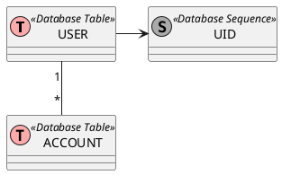
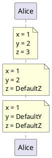
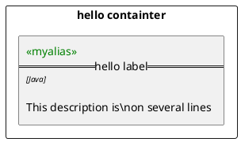

```plantuml
@startuml

!include library.plantuml

LAYOUT_LEFT_RIGHT

skinparam nodesep 50
skinparam ranksep 20

title Hello title

header hello header
footer hello footer
rectangle "Test Rectangle"

rectangle "Outer Rectangle" {
  rectangle "Rectangle"
  rectangle "2nd rectange"
}
package "hello" as pack {

}


database "db\nnote" as db1 {

}

Boundary(boundary1, "first boundry")

Boundary(boundary2, "Second Boundry", "type param")

boundary1 -> boundary2

Boundary(boundparent1, "Parent") {

  rectangle "Child" as child1
  database "inside db" as db2
  child1 -> db2
}


b-->c: Hello
ba*-->ca:hello
bb*....>cb:hello

Actor "Actor 1" as act1
interface "interface" as Inter1
act1 ->Inter1: here is some text


actor actor
agent agent
artifact artifact
boundary boundary
card card
cloud cloud
component component
control control
database database
entity entity
file file
folder folder
frame frame
interface  interface
node node
package package
queue queue
stack stack
rectangle rectangle
storage storage
usecase usecase

@enduml

```


```plantuml
@startuml
help skinparams
@enduml

```

Define









----


